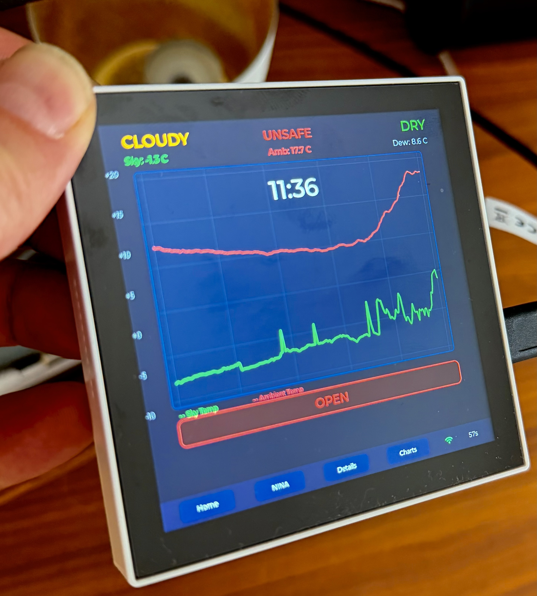

# CloudWatcher and AstroShell Waveshare Display

Native touch display for the AAG CloudWatcher Solo weather station and NINA and Domeshell Status, built on the Waveshare ESP32-P4 WiFi6 Touch LCD 4B (720x720).

   

## What This Does

A standalone observatory weather monitor that runs on bare metal (no Linux, no OS overhead). Polls an AAG CloudWatcher Solo, a N.I.N.A. imaging session, and an AstroShell dome controller over your local network, then renders everything on a 4-inch 720x720 IPS touchscreen in real time. Designed for remote observatory dashboards where you need a quick glance at conditions from across the room.




## Features at a Glance

### 4 Touch Screens (swipe or tap to navigate)

**Screen 1 — Home Overview**
- Big color-coded weather status: **CLEAR / CLOUDY / OVERCAST** and **DRY / WET / RAIN**
- Central **SAFE / UNSAFE** indicator for at-a-glance observing decisions
- Large **NTP clock overlay** (48px white) rendered directly inside the chart area, readable from several meters away
- Dual-line 24h temperature chart: sky temperature (green) + ambient temperature (red) with auto-scaled Y-axis
- Sky temp, ambient temp, and dew point values in the header
- **Dome status banner** with colored box: CLOSED (green), OPEN (red), or unknown (yellow) — queried directly from the AstroShell dome Arduino controller, independent of N.I.N.A.

**Screen 2 — N.I.N.A. Live Image**
- Displays the latest sub-exposure from a running N.I.N.A. imaging session
- Software JPEG decoder (TJPGD) with automatic downscaling to fit the 720x670 display area
- Metadata overlay: target name, filter, exposure time, star count, HFR, gain, image count, timestamp
- Manual refresh button — tap to fetch a new frame immediately without waiting for the poll timer
- Graceful degradation: shows "No active session" or "NINA offline" when the imaging PC is unreachable

**Screen 3 — Sensor Details Dashboard**
- 3x2 card grid: Sky Temperature, Ambient Temperature, Humidity, Rain, Sky Quality (mpsas), Pressure
- Each card shows the current value and a color-coded safety status (green = safe, red = unsafe)
- Title bar with data timestamp and safe/unsafe indicator
- Large bottom banner: "SAFE FOR OBSERVING" (green) or "UNSAFE FOR OBSERVING" (red)

**Screen 4 — Historical Charts**
- 6 tabbed 24h line charts: Cloud, Temperature, Humidity, Light, Rain, Pressure
- Each chart shows today (bright cyan) vs. yesterday (dim gray) as overlaid line series
- Fixed Y-axis ranges for consistent comparison across days (e.g., humidity always 30-100%, pressure auto-scaled)
- NTP clock overlay on chart area
- Dynamic Y-axis labels, current value and min/max summary below each chart
- 200-point downsampled display from ~750 raw data points per series

### Networking & Time

- **NTP time sync** — Automatic SNTP synchronization via `pool.ntp.org` after WiFi connects, timezone set to CET/CEST
- **Direct dome status query** — Polls the AstroShell Arduino dome controller at `192.168.1.177` via HTTP (`/?$S`), completely independent of N.I.N.A. or ASCOM. Works even when the imaging PC is off.
- **WiFi auto-reconnect** — Exponential backoff with up to 10 retries, then periodic 30s reconnect attempts
- **ESP-Hosted WiFi** — The ESP32-P4 has no native WiFi; all network traffic runs through the onboard ESP32-C6 co-processor via SDIO

### Polling & Refresh

| Data Source | Default Interval | Configurable |
|-------------|-----------------|--------------|
| CloudWatcher current data | 60s | Yes (menuconfig) |
| CloudWatcher 24h graphs | 240s | Yes (menuconfig) |
| N.I.N.A. image + dome status | 120s | Yes (menuconfig) |
| NTP time sync | 1 hour | Via sdkconfig |

## Hardware

- **Board:** [Waveshare ESP32-P4 WiFi6 Touch LCD 4B](https://www.waveshare.com/esp32-p4-wifi6-touch-lcd-4b.htm)
- **CPU:** ESP32-P4 dual-core RISC-V @ 360 MHz — significantly faster than ESP32-S3 or classic ESP32
- **Memory:** 32 MB PSRAM + 32 MB Flash — enough to hold decoded JPEG images, 24h graph data (~108 KB for 6 series), and the full LVGL framebuffer simultaneously
- **Display:** 4" 720x720 IPS, ST7703 controller via MIPI-DSI (2-lane) — not RGB parallel, which means higher bandwidth and less CPU overhead for rendering
- **Touch:** GT911 capacitive I2C touchscreen (uses backup address 0x14)
- **WiFi:** ESP32-C6 co-processor via SDIO (ESP-Hosted), WiFi 6 capable
- **Weather Station:** AAG CloudWatcher Solo (HTTP polling, no cloud dependency)
- **Dome Controller:** AstroShell Arduino (HTTP GET, plain text status response)
- **Imaging Software:** N.I.N.A. with Advanced API plugin (ninaAPI by Christian Palm)

### Why ESP32-P4?

The ESP32-P4 is a significant step up from earlier ESP32 variants for display-heavy applications:

- **360 MHz dual-core RISC-V** vs. 240 MHz Xtensa on ESP32-S3 — 50% higher clock speed with a more efficient ISA
- **Native MIPI-DSI** for the display interface — dedicated peripheral, zero CPU involvement for pixel transfer
- **32 MB PSRAM** — enough to hold multiple full-resolution decoded images in memory without swapping or streaming
- **Hardware JPEG decoder** available (though this project uses the software TJPGD decoder for flexibility with non-standard JPEG streams)
- Sustained **30 fps LVGL rendering** on a 720x720 display while simultaneously running HTTP clients, JSON parsing, and JPEG decoding on background tasks — no frame drops

## Project Structure

```
main/
  main.c                — Entry point, FreeRTOS task creation, polling loops
  display_driver.c/h    — Manual DSI + GT911 init with graceful I2C fallback
  wifi_manager.c/h      — ESP-Hosted WiFi + NTP time sync
  cloudwatcher_client.c/h — HTTP fetch + key=value parser for lastData.pl / graphData.pl
  nina_client.c/h       — N.I.N.A. image fetch, JPEG decode, dome status query
  ui_main.c/h           — Screen management, swipe + button navigation
  ui_home.c/h           — Home screen: status + chart + clock + dome banner
  ui_nina.c/h           — N.I.N.A. image screen with metadata overlay
  ui_dashboard.c/h      — Sensor card grid + safe/unsafe banner
  ui_charts.c/h         — 6 tabbed 24h charts with today/yesterday overlay
  Kconfig.projbuild     — All configurable parameters (WiFi, IPs, ports, intervals)
```

## Development Setup (macOS)

### 1. Install Prerequisites

You need **ESP-IDF v5.4+** (the ESP32-P4 is only supported from v5.4 onwards).

```bash
# Install system dependencies via Homebrew
brew install cmake ninja dfu-util python3

# Clone ESP-IDF v5.4 (or newer) into ~/esp
mkdir -p ~/esp && cd ~/esp
git clone -b v5.4 --recursive https://github.com/espressif/esp-idf.git

# Run the ESP-IDF install script (downloads toolchains for ESP32-P4)
cd ~/esp/esp-idf
./install.sh esp32p4
```

This takes a few minutes on first run. It installs the RISC-V toolchain, Python packages, and build tools into `~/.espressif/`.

### 2. Clone This Project

```bash
cd ~/Desktop  # or wherever you keep your projects
git clone https://github.com/joergsflow/cloudwatcher-waveshare.git
cd cloudwatcher-waveshare
```

### 3. Activate the ESP-IDF Environment

You need to source this **once per terminal session** before building:

```bash
source ~/esp/esp-idf/export.sh
```

> **Tip:** Add an alias to your `~/.zshrc` for convenience:
> ```bash
> alias get_idf='source ~/esp/esp-idf/export.sh'
> ```
> Then just type `get_idf` in any new terminal.

### 4. Configure WiFi and CloudWatcher IP

```bash
idf.py menuconfig
```

Navigate to **CloudWatcher Configuration** and set:

| Setting | Default | Description |
|---------|---------|-------------|
| WiFi SSID | MyNetwork | Your WiFi network name |
| WiFi Password | MyPassword | Your WiFi password |
| CloudWatcher IP | 192.168.1.151 | CloudWatcher Solo IP address |
| CloudWatcher Port | 80 | CloudWatcher HTTP port |
| Poll Interval | 60s | Current data refresh interval |
| Graph Poll Interval | 240s | Graph data refresh interval |

Navigate to **NINA Configuration** and set:

| Setting | Default | Description |
|---------|---------|-------------|
| NINA PC IP | 192.168.1.114 | IP of the imaging PC running N.I.N.A. |
| NINA API Port | 1889 | ninaAPI Advanced API plugin port |
| NINA Dome Port | 1888 | NINA dome control API port |
| Dome Controller IP | 192.168.1.177 | AstroShell Arduino dome controller IP |
| Dome Controller Port | 80 | AstroShell dome controller HTTP port |
| NINA Poll Interval | 120s | Image + dome refresh interval |

Press `S` to save, then `Q` to quit. The settings are stored in `sdkconfig`.

### 5. Build

```bash
idf.py build
```

First build takes a few minutes (compiles LVGL, ESP-Hosted, etc.). Subsequent builds are incremental and much faster.

### 6. Find the USB Port

Connect the board via USB-C. The Waveshare ESP32-P4 board uses a **CH340 USB-serial chip**. On macOS the port name looks like `/dev/cu.usbmodemXXXX` (the exact number changes on reconnect).

```bash
# List available serial ports
ls /dev/cu.usbmodem*
```

If nothing shows up, make sure you're using the correct USB-C port on the board (the one labeled **USB** or **UART**, not the one labeled **USB-OTG**). You may also need to install the [CH340 driver](https://www.wch-ic.com/downloads/CH341SER_MAC_ZIP.html) if macOS doesn't recognize it.

### 7. Flash and Monitor

```bash
# Flash firmware and open serial monitor (replace port if needed)
idf.py -p /dev/cu.usbmodem* flash monitor
```

The serial monitor shows boot logs and WiFi connection status. Press `Ctrl+]` to exit the monitor.

### Quick Reference

```bash
# Full workflow in one go
source ~/esp/esp-idf/export.sh
idf.py build
idf.py -p /dev/cu.usbmodem* flash monitor
```

## Architecture

```
FreeRTOS Tasks:
  LVGL task         — display rendering (~30 fps, managed by BSP)
  cw_poll_task      — CloudWatcher current data + graph fetching
  nina_poll_task    — N.I.N.A. image fetch + dome status query

Screens: Home <-> NINA <-> Details <-> Charts (swipe or tap nav bar)

Network stack:
  ESP32-P4 (main CPU) --SDIO--> ESP32-C6 (WiFi co-processor) --WiFi--> LAN
```

The ESP32-P4 has no native WiFi — it uses an onboard ESP32-C6 co-processor connected via SDIO (ESP-Hosted). All HTTP clients run on the P4 and transparently route through the C6.

## Data Sources

| Source | Endpoint | Format |
|--------|----------|--------|
| CloudWatcher current | `http://<cw_ip>/cgi-bin/lastData.pl` | Key=value pairs (~300 bytes) |
| CloudWatcher graphs | `http://<cw_ip>/cgi-bin/graphData.pl` | JavaScript arrays (~160 KB, ~750 pts/series) |
| N.I.N.A. image | `http://<nina_ip>:<port>/v2/api/equipment/camera/image` | JPEG binary |
| N.I.N.A. metadata | `http://<nina_ip>:<port>/v2/api/history/latest` | JSON |
| Dome status | `http://<dome_ip>/?$S` | Plain text: "OPEN" or "CLOSED" |

## CloudWatcher Safety Thresholds

Based on the AAG CloudWatcher Solo configuration for observatory Wietesch (52.17N, 7.25E):

| Sensor | Safe | Warning | Unsafe |
|--------|------|---------|--------|
| Sky Temp (clouds) | < -6 C (Clear) | < 5 C (Cloudy) | >= 5 C (Overcast) |
| Rain | > 2500 (Dry) | > 2000 (Wet) | <= 2000 (Rain) |
| Sky Quality | > 17 mpsas (Dark) | > 13 mpsas (Light) | <= 13 mpsas (Bright) |
| Humidity | < 50% (Dry) | < 80% (Normal) | >= 80% (Humid) |

## Changelog

### v0.4.2
- NTP time sync (pool.ntp.org, CET/CEST timezone) with large clock overlay on home screen chart
- Direct AstroShell dome controller query (HTTP `/?$S`) — independent of N.I.N.A.
- Dome status banner with colored box: CLOSED (green), OPEN (red), Domestatus? (yellow)
- NINA/dome poll interval reduced from 5 minutes to 2 minutes
- Clock overlay on charts screen

### v0.4.1
- N.I.N.A. live image display with software JPEG decoder (TJPGD)
- Dome status display on home screen
- Manual image refresh button

### v0.4.0
- N.I.N.A. image screen with hardware JPEG decoder
- Fixed chart Y-axis scaling with per-series ranges
- 4-screen navigation (Home, NINA, Details, Charts)

### v0.3.0
- 3-screen layout: Home, Dashboard, Charts
- Swipe navigation + bottom nav bar
- 24h historical charts with today/yesterday overlay
- Manual Y-axis labels (LVGL 9 workaround)

## License

MIT
